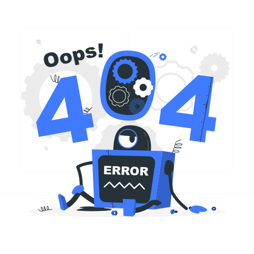

# 🚧 Oops! Page Not Found (404)

It looks like the page you're looking for doesn't exist. This might be because:

- 🔍 The URL is incorrect or has been changed.
- 🔄 The page has been moved or deleted.
- 🛠️ There's an issue with the documentation structure.

## 🔗 Try these options:
- 📜 [Go back to the homepage](index.md)
- 📬 [Report this issue](https://github.com/myusername/myproject/issues)

Still need help? Reach out to us at **[support@example.com](mailto:support@example.com)**.

---

    

