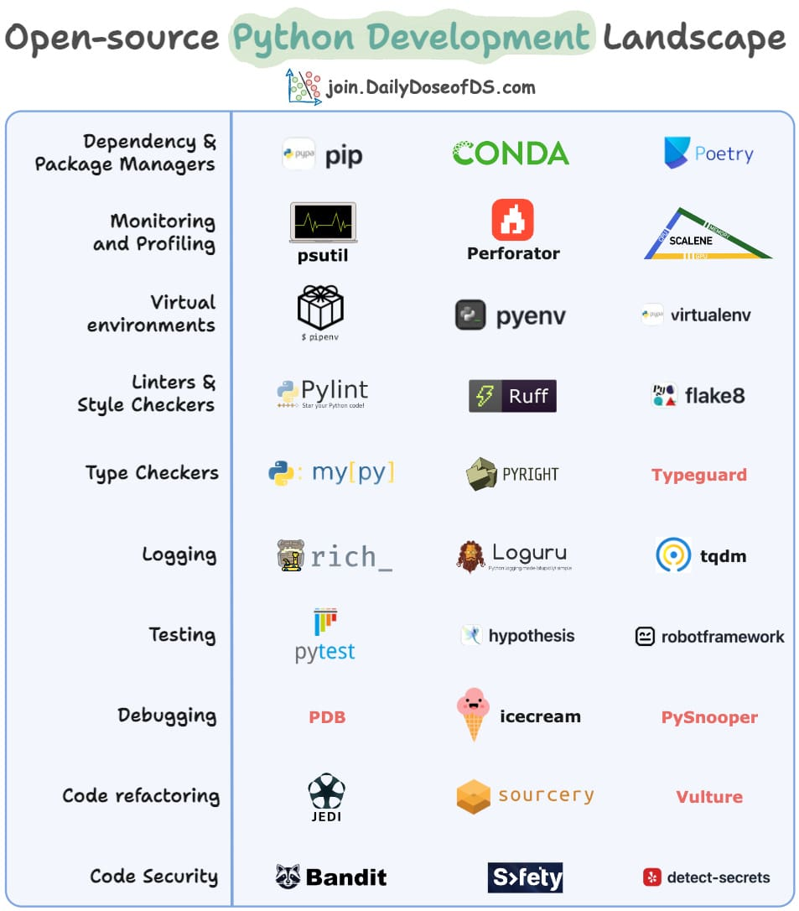

# Open-source Python Development Landscape

Python development involves various stages and a wide array of tools to manage them effectively. This guide provides a structured overview of essential tools developers can use across different aspects of Python development, from dependency management to code security.

---

## 1. Dependency & Package Managers
Tools to manage Python package installations and dependencies.

- **pip**  
  The default package manager for Python, used to install and manage libraries.
- **Conda**  
  A package, dependency, and environment manager supporting multiple programming languages.
- **Poetry**  
  A dependency management tool that simplifies package management and publishing.

---

## 2. Monitoring and Profiling
Tools to optimize and analyze performance.

- **psutil**  
  Provides system and process utilities for monitoring resource usage.
- **Perforator**  
  A cluster-wide continuous profiling tool designed for large data centers, offering reliable production-ready CPU profiling without performance impact.
- **Scalene**  
  A high-performance Python profiler for CPU, memory, and GPU usage.

---

## 3. Virtual Environments
Tools to ensure project isolation and manage dependencies efficiently.

- **pyenv**  
  Helps manage multiple Python versions on a system.
- **virtualenv**  
  Creates isolated Python environments to manage dependencies efficiently.
- **pipenv**  
  Combines `pip` and `virtualenv` for better dependency management.

---

## 4. Linters & Style Checkers
Tools to enforce coding standards and maintain code quality.

- **Pylint**  
  Checks for errors and enforces coding standards.
- **Ruff**  
  A fast Python linter and formatter.
- **Flake8**  
  Combines various linting tools into a single framework.

---

## 5. Type Checkers
Tools to ensure type correctness in Python codebases.

- **mypy**  
  A static type checker for Python.
- **Pyright**  
  A fast type checker developed by Microsoft.
- **Typeguard**  
  A runtime type checker for Python.

---

## 6. Logging
Tools to monitor application behavior and track issues.

- **Rich**  
  Provides beautiful console output with formatting, tables, and progress bars.
- **Loguru**  
  A modern logging framework for Python.
- **tqdm**  
  A simple, fast progress bar for loops.

---

## 7. Testing
Tools to automate testing for software reliability.

- **pytest**  
  A widely used testing framework for Python.
- **hypothesis**  
  A property-based testing library.
- **Robot Framework**  
  A keyword-driven testing framework.

---

## 8. Debugging
Tools to identify and fix issues in your code.

- **PDB**  
  The built-in Python debugger.
- **Icecream**  
  A debugging tool that prints variables and expressions.
- **PySnooper**  
  A lightweight debugging utility that logs function execution details.

---

## 9. Code Refactoring
Tools to improve and restructure code efficiently.

- **Jedi**  
  An autocompletion and static analysis library for Python.
- **Sourcery**  
  An AI-powered code refactoring tool.
- **Vulture**  
  Finds unused code in Python projects.

---

## 10. Code Security
Tools to detect and mitigate security vulnerabilities.

- **Bandit**  
  A security linter for identifying vulnerabilities in Python code.
- **Safety**  
  Checks Python dependencies for security vulnerabilities.
- **Detect-Secrets**  
  Scans code for hardcoded secrets.

---

## Conclusion
These tools are invaluable for any Python developer, covering everything from virtual environments and dependency management to debugging, logging, and security. Incorporating them into your workflow can significantly enhance your development experience and improve code quality.